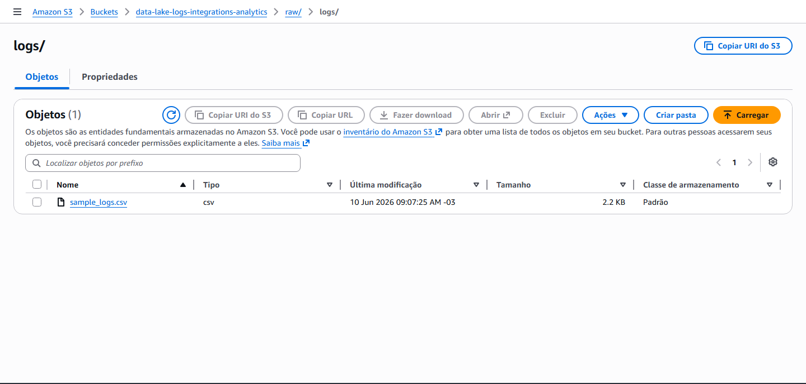
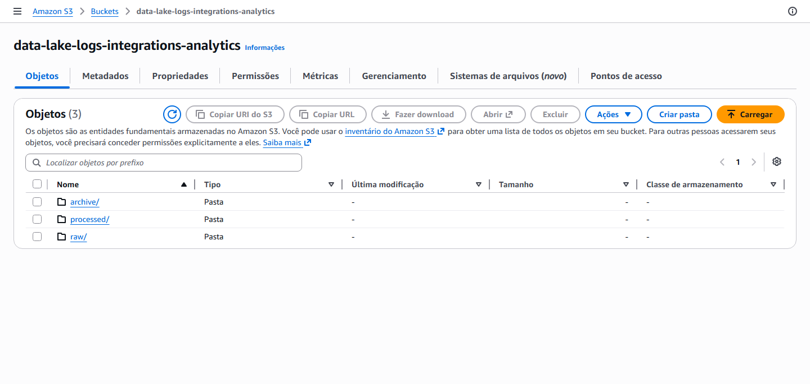

# Data Engineering Project: Aprendendo PySpark e Boto3

Este repositório documenta e implementa um projeto prático de Engenharia de Dados Distribuídos, focado na construção de pipelines resilientes e escaláveis utilizando **PySpark** e integração profunda com o ecossistema **AWS** (principalmente S3 e Boto3).

## 🎯 Objetivo do Projeto

Capacitar desenvolvedores na construção e otimização de pipelines de dados, desde a ingestão de dados brutos até o processamento, transformação e persistência em formatos otimizados, utilizando ferramentas modernas de big data e cloud computing.

O projeto simula um ambiente de back-end com foco em dados e integrações, alinhado com as responsabilidades de um Desenvolvedor Backend Sênior, conforme descrito em nossa documentação de vaga.

## 🛠️ Tecnologias Principais

-   **PySpark**: Processamento distribuído de dados em larga escala.
-   **AWS S3**: Data Lake para armazenamento de dados brutos e processados.
-   **AWS Boto3**: SDK Python para orquestração e interação com serviços AWS.
-   **Docker / Docker Compose**: Para conteinerização dos bancos de dados (ScyllaDB, MongoDB, PostgreSQL).
-   **ScyllaDB**: Banco de dados distribuído de alta performance.
-   **MongoDB**: Banco de dados NoSQL para documentos flexíveis.
-   **PostgreSQL**: Banco de dados relacional para dados transacionais.
-   **Node.js**: Para o desenvolvimento de APIs e integrações (no contexto da stack).
-   **Dynatrace**: Observabilidade e monitoramento dos fluxos e serviços.

## 🚀 Fluxo de Dados e Orquestração (Laboratórios 02 e 03)

O pipeline central deste projeto envolve os seguintes passos, ilustrados nas imagens abaixo:

1.  **Ingestão de Dados Brutos (Landing Zone)**: Arquivos CSV de logs são depositados em um bucket S3 na área `raw/logs/`.
    

2.  **Orquestração e Detecção de Novos Dados**: Um orquestrador em Python (Boto3) monitora a pasta `raw/logs/` no S3.
    -   Se não houver novos dados, o processo é encerrado.
        
    -   Se novos arquivos CSV forem detectados, o job PySpark é iniciado.
        

3.  **Processamento Batch com PySpark**: O job Spark lê os arquivos CSV, aplica transformações (limpeza, padronização, adição de flags) e persiste os dados em formato **Parquet** otimizado para consultas analíticas.

4.  **Movimentação para Arquivo**: Após o processamento bem-sucedido, os arquivos CSV originais são movidos da área `raw/logs/` para `archive/logs/` para evitar reprocessamento e manter a zona de pouso limpa.
    

## 📚 Progresso do Curso / Laboratórios

O progresso detalhado e a documentação completa podem ser acompanhados em:

-   [📖 Documentação Técnica](./.docs/tech/index.md)
-   [🎓 Plano de Ensino: PySpark & Boto3](./.docs/learning/pyspark-boto3-course.md)

## ⚙️ Configuração do Ambiente

1.  **Credenciais AWS**: Configure suas credenciais de acesso (`AWS_ACCESS_KEY_ID`, `AWS_SECRET_ACCESS_KEY`, `AWS_REGION`) em um arquivo `.env` na raiz do projeto, conforme as boas práticas recomendadas.
2.  **Serviços de Banco de Dados**: Utilize o `docker-compose.yml` para iniciar os bancos de dados locais (ScyllaDB, MongoDB, PostgreSQL).
    ```bash
    docker-compose up -d
    ```
3.  **Dependências Python**: Instale as dependências PySpark e Boto3.

Para mais detalhes e execução de cada laboratório, consulte o arquivo de curso.

## Se tiver dados ele processa os dados e cria duas pastas:
- Para dados processados e convertidos para parquet `/processed`
- Para dados já processados, mas mantendo seu formato original `/archive`


# Script python não encontrando dados no Data Lake do Amazon S3 
